# PgoAgent
                    

本项目是一个具备长期与短期记忆、多代理协作处理能力、本地工具集成及检索增强生成功能的**PgoAgent**的智能体系统(基于**Langgraph + Chromadb + Agentic Rag + MCP**系统)。它采用**vllm**本地部署的大语言模型(**LLM**)并使用**PostgreSQL**存储用户数据，后端则通过**gRPC**、**GORM**及**Gin**框架协调代理**Agent服务端**的输出。


**版本**: v0.0.3  
**作者**: Soul-XuYang 
**许可证**: MIT 

---

This is an intelligent agent system named **PgoAgent**, featuring long-term and short-term memory, multi-agent collaboration capabilities, local tool integration, and retrieval-augmented generation functions (based on **Langgraph** + **Chromadb ** + **Agentic Rag + MCP**). It employs a locally deployed large language model(**LLM**) using **vllm** and stores user data with **PostgreSQL**, while the backend coordinates agent outputs via **gRPC**, **GORM**, and **Gin** framework.

**version**: v0.0.3
**author**: Soul-XuYang
**license**: MIT

### 技术栈 - Technology Stack

#### Python 后端 (智能体核心)
- **python3.12+**: 开发环境基础，使用类型注解(typing)与Pydantic进行类型定义和验证,使用logguru进行日志管理。
- **asyncio**: 基于异步事件循环，实现 I/O 密集型任务的并发执行与工具调用调度。
- **Langgraph**: 本次项目使用**langgraph**框架作为agent的运行框架，构建相应的工作流图和工作节点，同时兼容MCP工具和本地编写的基本工具
- **多Agent** :实际将多个功能分为多个子图进行处理
    1. 智能判断是否需要调用工具将复杂任务分解为可执行的步骤序列
    2. 管理用户长期记忆和上下文信息
    3. 执行文件操作、代码执行、RAG 检索等任务
- **Agentic RAG**: 本项目使用Agentic RAG(Retrieval Augmented Generation)并采用双阈值+混合检索(向量检索 + BM25 关键词检索)+ Rerank的方式进行检索，可进行召回与重排(内置循环次数，限制其推理深度)。
- **MCP**: 可集成MCP工具，支持 MCP 协议的工具接入与扩展。
- **Finetunning**: 大模型微调模块，可进行模型微调，并保存模型参数。
- **VLLM**: 微调的大模型使用**vllm**框架进行部署相应的chat、emebdding和rerank模型服务。

#### Go Web后端 (服务端)
- **Gin**: web服务端使用Gin作为高性能 HTTP Web 框架，实现用户端接口与 Web 服务。
- **GORM**: 全新的ORM 框架，支持相关数据库操作。    
- **gRPC**: 作为跨语言通信机制，实现 Python 智能体与 Go 服务之间的高性能双向通信，支持流式响应以适配大模型增量输出。
- **Swagger**:  RESTful API 文档自动生成工具，规范接口设计与调试
#### 数据存储层
- **[PostgreSQL](https://www.postgresql.org/)**: 关系型数据库，配合 LangGraph 实现长短期记忆管理，存储用户信息、对话历史、短期数据与长期记忆体，此外配合Web服务端进行用户数据操作。
- **[ChromaDB](https://www.trychroma.com/)**: 向量数据库，用于文本片段、Embedding 的向量存储与相似度检索。
--- 
### 项目文件结构 - Project File Structure

```
PgoAgent/
├── src/                          # 源代码目录
│   ├── agent/                    # Python 智能体核心
│   │   ├── graph.py              # 主工作流图定义
│   │   ├── main_cli.py           # CLI 交互入口
│   │   ├── main_grpc.py          # gRPC 服务端实现入口
│   │   ├── subAgents/            # 子代理模块
│   │   │   ├── decisionAgent.py  # 决策代理 - 判断是否需要工具
│   │   │   ├── planAgent.py      # 计划代理 - 生成执行计划
│   │   │   └── memoryAgent.py    # 记忆代理 - 管理长期记忆
│   │   ├── rag/                  # RAG 检索模块
│   │   │   ├── RagEngine.py      # RAG 引擎核心
│   │   │   ├── database.py       # 向量数据库操作
│   │   │   ├── indexer.py        # 索引构建
│   │   │   └── loader.py         # 文档加载器
│   │   ├── tools/                # 工具模块
│   │   │   ├── rag_retrieve_tool.py  # RAG 检索工具
│   │   │   ├── file_tool.py      # 文件操作工具
│   │   │   └── shell_tool.py     # Shell 执行工具
│   │   ├── model/                # 模型封装
│   │   │   ├── llm.py            # 大语言模型接口
│   │   │   ├── embedding_model.py# 词嵌入模型
│   │   │   └── rerank_model.py   # 重排序模型
│   │   └── mcp_server/           # MCP 服务器
│   │       └── mcp_external_server.py  # 外部 MCP 工具集成
│   ├── WebServer/                # Go Web 服务
│   │   ├── main.go               # Web 服务入口
│   │   ├── config/               # 配置管理
│   │   ├── controllers/          # 控制器
│   │   ├── services/             # 业务服务
│   │   └── router/               # 路由定义
│   └── ModelDeployTune/          # 模型微调模块-详细看其README.md
├── scripts/                      # 脚本工具
├── proto/                        # gRPC 协议定义
├── test/                         # 部分测试代码，可忽略
├── mcp_configs/                  # MCP 工具配置,支持JSON类型的文件
└── chroma_db/                    # ChromaDB 数据存储
```
整体的架构层次说明如下：

1. **智能体核心层（Python）**: 核心能力载体，实现多代理协作、长短期记忆、Agentic RAG 检索、LLM 调用等核心逻辑
2. **服务层（Go）**: 对外提供 Web 服务，实现用户注册/登录、对话管理、记忆体定制，通过 gRPC 与 Python 核心层通信
3. **数据存储层**: 由 PostgreSQL（结构化数据/记忆）与 ChromaDB（向量数据/知识）组成，支撑系统数据持久化
4. **用户交互层**: 基于 Gin 的 Web 客户端，实现对话更新、消息列表、历史记录、记忆体画像自定义等用户操作
5. **前端界面**: 基于基本的 HTML、CSS、JS，实现用户界面的搭建
6. **模型微调层（可选）**: 本地可进行相关模型的微调训练和测试
<div align="center">

```
┌─────────────────────────────────────────────────────────────────┐
│                      Web Service Layer (Go)                     │
│  ┌──────────────┐  ┌──────────────┐  ┌──────────────┐           │
│  │   REST API   │  │  JWT Auth    │  │  Session     │           │
│  │   (Gin)      │  │  Rate Limit  │  │  Management  │           │
│  └──────────────┘  └──────────────┘  └──────────────┘           │
└────────────────────────────┬────────────────────────────────────┘
                             │ gRPC (TLS + JWT+ DUAL RateLimit)
┌────────────────────────────▼───────────────────────────────────┐
│                  Agent Service Layer (Python)                  │
│  ┌─────────────────────────────────────────────────────────┐   │
│  │              LangGraph Workflow Engine                  │   │
│  │  ┌────────────┐  ┌────────────┐  ┌────────────┐         │   │
│  │  │ Decision   │  │  Planner   │  │   Tools    │         │   │
│  │  │   Node     │  │    Node    │  │    Node    │         │   │
│  │  └────────────┘  └────────────┘  └────────────┘         │   │
│  │  ┌────────────┐  ┌────────────┐  ┌────────────┐         │   │
│  │  │ MemoryNode │  │  AgentNode │  |  ChatNode  │         │   │
│  │  └────────────┘  └────────────┘  └────────────┘         │   │
│  └─────────────────────────────────────────────────────────┘   │
│  ┌──────────────┐  ┌──────────────┐  ┌──────────────┐          │
│  │   Tools      │  │  AgenticRag  │  │   LLM API    │          │
│  │   and MCP    │  │    Memory    │  |  Interface   │          │
│  └──────────────┘  └──────────────┘  └──────────────┘          │
└─────────────────────────────┬──────────────────────────────────┘
                              │
        ┌─────────────────────┼────────────────────┐
        │                     │                    | 
┌───────▼──────┐  ┌───────────▼──────────┐  ┌──────▼──────┐
│  PostgreSQL  │  │      ChromaDB        │  │    vLLM     │
│ State Store  │  │  Vector Database     │  │  Model Svc  │
│ Memory/User  │  │  Knowledge Base      │  │ Chat/Emb/Rer│
└──────────────┘  └──────────────────────┘  └─────────────┘
```

</div>

### Agent整体的架构 - Agent Architecture Diagram
- **summarization_node**: 用户先前对话历史总结与裁剪，防止对话时的 token 溢出
- **decision_node**: 决策子图，判断此次对话是否需要调用工具
- **planner_node**: 计划子图，依据用户问题生成多步骤执行计划
- **chat_node**: 直接对话节点，处理无需工具的对话
- **agent_node**: 代理执行节点，执行具体计划步骤
- **tool_node**: 工具执行节点，调用具体工具
- **long_memory_node**: 长期记忆子图，依据用户问题和回答管理用户画像

Agent工作流程可见本文项目的workflow图：
<div align="center">

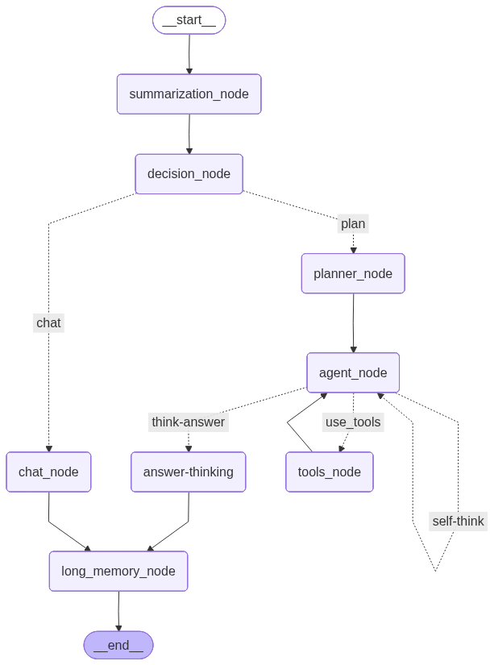 

</div>

#### Agent工作流程伪代码

```text
用户输入 → summarization_node(总结裁剪) → decision_node(是否需要工具)
    ↓
    ├─ 不需要工具 → chat_node(直接对话) → long_memory_node(更新记忆)
    │
    └─ 需要工具 → planner_node(生成计划) → agent_node(执行步骤)
                           ↓                    ↓
                      tool_node(调用工具) ←─────┘
                           ↓
                    判断是否完成 → 未完成 → 继续下一步
                           ↓
                      已完成 → long_memory_node(更新记忆)
```

#### 流程说明
1. 开始对话，首先进入summary节点，对于用户之前的记忆进行裁剪和总结，其次对于用户的输入并结合上下文信息判断此次对话是否调用工具，
2. 如果调用工具则进入plan节点，如果未调用工具则进入chat节点，其中chat节点会结合用户的长短期记忆力，对用户的问题进行回答。
3. 如果调用工具，则进入plan节点，开始规划此次对话总共需要哪些步骤，构建相应的计划列表并详细描述每一步的计划步骤可能需要的工具，后续进入agent节点，开始执行思考每一步的步骤和工具，如果需要工具则进入tool节点，开始执行工具，并返回结果给agent节点，agent节点根据结果判断是否需要继续执行下一步，如果继续则进入plan节点，重复上述步骤，直到所有步骤执行完毕。
4. 上述的2和3步骤最后都统一进入到long_memory节点，程序初次判断是否需要长期存储用户的画像，后则大模型继续判断并补充和完善画像，最后将用户的个人画像返回到数据库中。
#### 召回率的测试比较实验
为了提高rag的检索效率，这里引出机器学习其中关于召回率和精确率的概念:

| 指标                | 含义        | 关注点 | 公式简化       |
| ----------------- | --------- | --- | ---------- |
| **召回率 Recall**    | 相关的找回来多少  | 不漏掉 | 相关找回 / 总相关 |
| **精确率 Precision** | 找回来的里对的多少 | 不乱找 | 相关找回 / 总找回 |

从上述表格我们可以看出一个是看实际正确的比例，一个看的是预测争取的比例。

而这就是为何本系统后续主要是使用召回率做检验，因为对于RAG系统来说，漏了正确的是致命的，但是多了是可以补救的.**多了只是预测中的数量多了，Precision下降，只是多了噪声->可以使用Rerank
但漏了就是信息少了，完全没有办法，**无法无中生有**。


这里推荐新手的数据集可用于验收(json)，需要注意Token的使用率(极其容易爆炸):

| 场景 | 推荐数据集 | 规模 | 下载地址 |
| :--- | :--- | :--- | :--- |
| 快速验证（新手） | LiHua-World | 200 条 | https://gitee.com/fuhaoliang/MiniRAG/raw/master/dataset/LiHua-World/data/LiHuaWorld.zip |
| 标准检索测试 | DuRetrieval | 4000 条 | https://huggingface.co/datasets/C-MTEB/DuRetrieval/resolve/main/data/test.jsonl |

如有兴趣可以使用上方的数据集进行测试，可以查看[MiniRag](https://github.com/yeldhopp/hk-MiniRAG)项目资料(数据集 LiHua-World )，其包含了基本的数据集预处理以及构建使用
这里我对此进行了了一个基本的实验，我的Rag模型相比于基础的Rag提升了大约10.7%的召回率。

- **补充**: 模型统一针对上述的decision_node、plan_node和long_memory_node微调，以减少实际的模型调用次数和损耗并且使得其更加智能更可以适配本项目的实际需求。 

--- 
### Web服务端架构 - Web Service Architecture Diagram
其Web服务端是为了承接Agent的大模型回答请求，之所以使用grpc和go是为了具备更好的程序体验，二者同时实现职责解耦，提高系统的可维护性和可扩展性。:
- **go**: 该编程语言具有高并发、网络性能强、低资源的能力。
- **SSE**: 实时推送节点事件给前端，支持流式对话。
- **protobuf**: 语言无关的序列化协议，可支持任意语言的序列化与反序列化，可支持任意语言的编解码，可支持任意语言的流式编解码。
- **grpc**: 可承接高性能的结果上报。gRPC 使用 **Protobuf**，其通常比 JSON/XML 更紧凑，且编解码更快；同时支持流式传输，适合大模型增量返回。此外具有适配多语言的通信环境。
- **gin**: 承接浏览器/APP 的 HTTP 请求；鉴权、限流、会话、上传等功能，这里采用自定义的LRU和令牌桶算法使用。
- **gorm**: 构建用户、对话、消息列表，可记录和查询用户的对话历史，支持用户对于LLM对自身用户画像的修改和删除。
- **swagger**: 构建WEB服务端的API文档。
#### Web服务端工作流程伪代码

```text
HTTP请求(用户输入, mode=invoke|stream, stream_level=node) 
    → auth/ratelimit (鉴权/限流)
    → session_operation(获取/创建session; 拉取和管理：用户画像 + 长期记忆摘要 + 会话配置) 
    → persist_input(写入message/turn; 创建task_id; 记录mode与stream_level)
        ↓
    grpc_session_init(与后台Python Agent建立gRPC会话; 下发context: user_id/thread_id/user_profile/memory_summary/history_window)
        ↓
    ├─ mode=invoke:
    │     agent_invoke_node(一次性调用Agent运行到final)
    │         ↓
    │     persist_output_node(写入最终回答/usage/trace/节点摘要)
    │         ↓
    │     memory_sync_node(接收 long_memory 更新事件/结果并落库)
    │         ↓
    │     HTTP响应返回(final_answer + 元数据)
    │
    └─ mode=stream (node-stream):
          agent_stream(运行工作流; 产生节点事件流)
              ↓
          stream_mux_node(因框架和数据量限制，转发节点级事件: node_data)
              ↓
          forward_stream_node(SSE/WS推送节点事件给前端)
              ↓
          buffer_aggregate_node(聚合节点输出→最终回答草稿; 可选展示"正在总结/正在规划/正在检索"状态)
              ↓
          on_final_node(收到final_answer事件)
              ↓
          memory_sync(接收用户的输入获取其 long_memory 更新事件/结果并落库)
              ↓
          stream_close(关闭SSE/WS与gRPC流)
```
#### 流程说明

1. 用户登录及注册账户，后续基于其TokenBing鉴权和令牌桶限流，并获取用户画像、长期记忆摘要以及当前会话配置，为后续处理提供基础信息。

2. 鉴权通过后，请求进入`session_operation`主界面，同时获取其历史对话窗口进行和整理。

3. 用户点击开始对话按钮，系统将本轮用户输入写入`message/turn`存储中，并生成唯一的UUID，同时记录当前请求的运行模式（`invoke`或`stream`）以及事件流级别，用于后续执行追踪与结果回溯。

4. Web客户端与服务端 Python Agent 建立 gRPC 会话，并将本次推理所需的上下文信息下发给 Agent，包括`user_id`、`thread_id`、用户画像、长期记忆摘要以及裁剪后的历史对话窗口，正式进入 Agent 执行阶段。

5. 当`mode=invoke`时，系统进入`agent_invoke`，Agent 在单次调用中执行完整的工作流并直接运行并生成最终回答；执行结束后将相关数据返回给Web客户端，Web客户端将最终回答、模型使用情况、以及对话时间等信息写入存储数据库中，最后Web系统通过 HTTP 一次性返回最终回答及相关元数据。

6. 当`mode=stream`时，系统进入`agent_stream`执行流程，Agent 在运行内部工作流的同时持续产出节点级事件流；系统仅保留节点级别的数据输出，并通过 SSE 或 WebSocket 的方式实时推送至 Web 前端。在流式执行过程中，Web 系统持续接收并聚合节点输出，判断是否达到最终结果，同时向用户展示当前执行状态（如"正在规划""正在检索""正在总结"等）；当最终结果生成后，系统将本轮对话中识别出的用户长期记忆更新结果统一写入长期记忆库，并关闭前端 SSE/WS 连接以及后端 gRPC 流，完成本次对话请求。

7. 本系统同时也支持用户查看历史对话记录，并提供新增、删除会话等管理功能，同时支持用户对其长期记忆相关的用户画像进行自定义配置与调整。

**补充**：系统在流式与非流式模式下统一对会话管理、记忆同步和结果落库逻辑进行抽象与复用，同时针对 Agent 内部的关键决策节点进行结构化事件输出，以减少前端与后端之间的耦合度，并提升整体系统的可扩展性与稳定性。

---
### 部署和微调模型 - Deploy and Fine-Tunning Model 
详情可见项目根目录下的`src/ModelDeployTune/README.md`文件，该文档具体阐述了如何对模型进行微调。
#### 部署
首先依据对应的requirements.txt安装对应的python环境。
需查看config.py文件依据所需修改相应参数并下载所需模型进行部署。

**注**: 本次项目以Qwen3-8B模型作为主对话chat模型，以BAAI-bge-m3作为词嵌入embedding模型，后续的重排序rerank模型则使用bge-reranker-base。用户可自行选择自己所需的模型进行部署。

#### 微调须知
模型微调过程依赖于 transformers 库、torch 框架以及 peft 轻量化微调库，具体实现方式可参考对应目录下的 fine_tuning 文件。
本项目选取的小模型参数量是1.5B-3B，最终选取Qwen3-2.5B 参数量适中（2.5B），其在性能与资源消耗之间取得了较好的平衡，主要优势包括：
- 中文能力强，适合你的中文场景
- 结构化输出表现好（Pydantic 支持）
- 显存需求合理（LoRA 微调约 6-8GB）
- 推理速度快（适合实时场景）
#### 微调流程

1. 基于项目`src/ModelDeployTune/fine_tuning`模块，准备目标业务场景的用户画像/对话/任务微调数据集：
   - `dataset_tasks_generator.py` 生成微调所需的数据集
   - `convert_to_messages.py` 统一数据格式
   - `dataset_cleansing.py` 清洗数据集
   - `dataset_spliter.py` 划分训练集、验证集和测试集

2. 对基础大模型进行轻量化微调，执行微调脚本`train.py`，后可按需执行`merge.py`对于模型权重参数进行合并。

3. 微调完成后，将新模型通过vLLM重新部署（参考本地大模型部署的README.md步骤，相关可见`train.py`和`test.py`文件）。

4. 修改项目配置文件中的 LLM 调用地址，完成模型替换，后续可用SSH远程连接大模型服务器（这里详情可见项目根目录`test`目录下的`ssh_llm_test.ipynb`文件）。
---
### MCP工具配置

这里需要查看`mcp_configs`文件里的`admin`的`.json`文件，可后续根据用户需求进行修改和添加。
用户可以按需自己配置所需的MCP工具，这里以[魔搭社区](https://modelscope.cn/mcp/servers/@amap/amap-maps)的高德地图MCP为例。

相关的JSON文件如下，`transport`为`streamable_http`，表示使用流式HTTP传输，而`url`则是调用该MCP工具的地址。这里以高德地图为例，用户可自行获取对应大模型的API接口和密钥（`XXX`需要替换）：

```json
{
    "amap-maps-streamableHTTP": {
        "transport": "streamable_http",
        "url": "https://mcp.amap.com/mcp?key=XXX"
    }
}
```

---
### 本地运行 - Local Running

#### 预先补充

**首先配置好`.env`和`config.toml`文件，确保其参数配置正确，具体可参考`.env`文件和`config.toml`文件的参数格式。**

注意: 这里可依据自身所需填入对应的模型API接口和密钥，`.env`文件格式如下：

```env
OPENAI_API_KEY=""
OPENAI_BASE_URL="https://api.moonshot.cn/v1"
EMBEDDING_MODEL_URL="https://api.siliconflow.cn/v1/embeddings"
EMBEDDING_API_KEY=""

DATABASE_URL=""

RERANK_MODEL_URL="https://api.siliconflow.cn/v1/rerank"
RERANK_API_KEY=""

LANGSMITH_API_KEY=""
GEMINI_API_KEY=""
GRPC_TOKEN="PgoAgent"
WEB_TOKEN="PgoWeb"
```

- **网络API**：可自行获取对应大模型的API接口和密钥，这里可参考`.env`文件和`config.toml`文件的参数格式

- **本地大模型**：本次项目也使用的是在服务器上使用vLLM部署的大模型（可自己配置使用），详细可见文件夹`src/ModelDeployTune`下的README.md文件

- **用户数据库**：PostgreSQL数据库，可自行配置，具体可参考`.env`文件和`config.toml`文件的参数格式

> **补充**: 这里优先推荐使用网络API进行调用，PostgreSQL数据库推荐使用Docker进行部署
### 脚本列表

| 脚本文件 | 平台 | 功能描述 |
|---------|------|---------|
| `generate_grpc.bat` | Windows | 生成 gRPC 代码（Python + Go）和 TLS 证书 |
| `generate_grpc.sh` | Linux/Mac | 生成 gRPC 代码（Python + Go）和 TLS 证书 |
| `fix_grpc_imports.py` | 跨平台 | 修复 gRPC Python 代码中的导入问题 |
| `tls.py` | 跨平台 | 生成 TLS/SSL 证书和私钥 |
| `init_rag.py` | 跨平台 | 初始化 RAG 引擎，构建向量索引 |


**使用方法：**

**Windows:**
```batch
# 从项目根目录执行
scripts\generate_grpc.bat
```

**Linux/Mac:**
```bash
# 从项目根目录执行
chmod +x scripts/generate_grpc.sh
./scripts/generate_grpc.sh
```
**生成的文件：**
- Python: `src/agent/agent_grpc/agent_pb2.py`
- Python: `src/agent/agent_grpc/agent_pb2.pyi` (类型存根)
- Python: `src/agent/agent_grpc/agent_pb2_grpc.py`
- Go: `src/WebServer/agent_grpc/agent.pb.go`
- Go: `src/WebServer/agent_grpc/agent_grpc.pb.go`
- TLS: `certs/server.crt`
- TLS: `certs/server.key`

#### fix_grpc_imports.py脚本文件

**使用方法：**
```bash
# 从项目根目录执行
python scripts/fix_grpc_imports.py
```
该脚本会修复 gRPC 生成的 Python 代码中的导入问题。gRPC Python 代码生成器默认使用绝对导入，但在包结构中需要使用相对导入。
**示例：**
```python
# 修复前
import agent_pb2 as agent__pb2

# 修复后
from . import agent_pb2 as agent__pb2
```

#### tls.py脚本文件

**使用方法：**
```bash
# 使用默认设置（365天有效期，保存到 certs/）
python scripts/tls.py

# 自定义有效期（例如 730 天）
python scripts/tls.py --days 730

# 自定义证书保存目录
python scripts/tls.py --cert_dir /path/to/certs

# 组合使用
python scripts/tls.py --days 365 --cert_dir certs
```

**输出文件：**
- `certs/server.crt` - SSL 证书
- `certs/server.key` - 私钥文件

#### init_rag.py脚本文件

**使用方法：**
```bash
# 从项目根目录执行
python scripts/init_rag.py
```

初始化 RAG（检索增强生成）引擎，加载知识库文件并构建向量索引。

**功能：**

```python
init_rag_engine(
    collection_name: str = "my_vector",  # 向量库名称
    path: str = FILE_PATH,               # 文档路径（默认：项目根目录/file）
    file_name: str | list[str] = None,   # 文档名称或列表（None 表示加载所有文件）
    mode: str = None                     # 分割模式
)
```

**功能说明：**
- 加载指定文件或文件夹中的所有文档
- 支持多种文档格式（Markdown、PDF、TXT 等）
- 支持多种文本分割模式
- 构建向量数据库索引

**分割模式（mode 参数）：**
- `None`: 针对 Markdown/HTML 的标题分割（默认）
- `"recursive"`: 递归分割
- `"semantic"`: 语义分割
### Python Agent环境的构建和运行

**注意**: 本项目的**proto**文件和相关的**grpc**代码已生成，无需再次执行`generate_grpc.bat`或`generate_grpc.sh`脚本以及`fix_grpc_imports.py`。这里可按需执行。

#### 环境准备

**方式一：使用 uv（推荐，项目已配置 uv.lock 和 pyproject.toml）**

```bash
# 进入项目根目录
cd /path/to/PgoAgent

# 安装 uv（如果未安装）
# Windows:
powershell -ExecutionPolicy Bypass -c "irm https://astral.sh/uv/install.ps1 | iex"

# Linux/Mac:
curl -LsSf https://astral.sh/uv/install.sh | sh

# 使用 uv 创建虚拟环境并安装依赖
uv venv

# 激活虚拟环境
# Windows:
.venv\Scripts\activate

# MacOS/Linux:
source .venv/bin/activate

# 使用 uv 同步依赖（从 uv.lock 和 pyproject.toml）
uv sync
```

**方式二：使用传统 pip**

```bash
# 进入项目根目录
cd /path/to/PgoAgent

# 创建虚拟环境
python -m venv .venv

# 激活虚拟环境
# Windows:
.venv\Scripts\activate

# MacOS/Linux:
source .venv/bin/activate

# 安装依赖（使用项目根目录的 pyproject.toml 或 src/agent/requirements.txt）
# 如果使用 pyproject.toml
pip install -e . -i https://pypi.tuna.tsinghua.edu.cn/simple

# 或使用 requirements.txt
pip install -r src/agent/requirements.txt -i https://pypi.tuna.tsinghua.edu.cn/simple
```

#### 初始化配置（可选）

```bash
# 进入脚本目录
cd scripts

# 构建对应的 Proto 脚本、gRPC 协议和 TLS 证书
# （注意：本项目已构建完毕，可跳过此步骤）

# Windows:
generate_grpc.bat

# MacOS/Linux:
chmod +x generate_grpc.sh
./generate_grpc.sh

# 修复 gRPC 导入问题
python fix_grpc_imports.py

# 生成 TLS 证书
python tls.py

# 初始化 RAG 向量数据库
python init_rag.py

# 返回项目根目录
cd ..
```

#### 启动服务

```bash
# 启动 gRPC 服务
python src/agent/main_grpc.py

# 或者可以先启动终端服务进行测试
python src/agent/main_cli.py
```
### Go Web服务环境的构建和运行

#### 环境准备

```bash
# 进入 WebServer 目录
cd src/WebServer

# 安装必需的 Go 工具（首次运行需要）
# 安装 Protocol Buffers 的 Go 代码库
go install google.golang.org/protobuf/cmd/protoc-gen-go@latest

# 安装 gRPC 的 Go 代码库
go install google.golang.org/grpc/cmd/protoc-gen-go-grpc@latest

# 安装 Swagger 文档生成工具
go install github.com/swaggo/swag/cmd/swag@latest

# 初始化并安装 Go 依赖
go mod tidy
```

#### 生成 Swagger 文档（可选）

可以根据`scripts`目录下的`swagger.bat`或`swagger.sh`文件，依据操作系统运行对应脚本文件或者直接使用命令行构建。

**方式一：使用脚本（推荐）**

```bash
# Windows
scripts\swagger.bat

# MacOS/Linux
chmod +x scripts/swagger.sh
./scripts/swagger.sh
```

**方式二：直接使用命令**

```bash
# 在 src/WebServer 目录下执行
swag init --parseDependency --parseInternal -g main.go -o ./docs
```

**查看文档：**
- 默认地址: http://localhost:8080/swagger/index.html

#### 启动服务

```bash
# 在 src/WebServer 目录下执行
go run main.go
```

---
### 效果展示
终端命令行:
<div align="center">

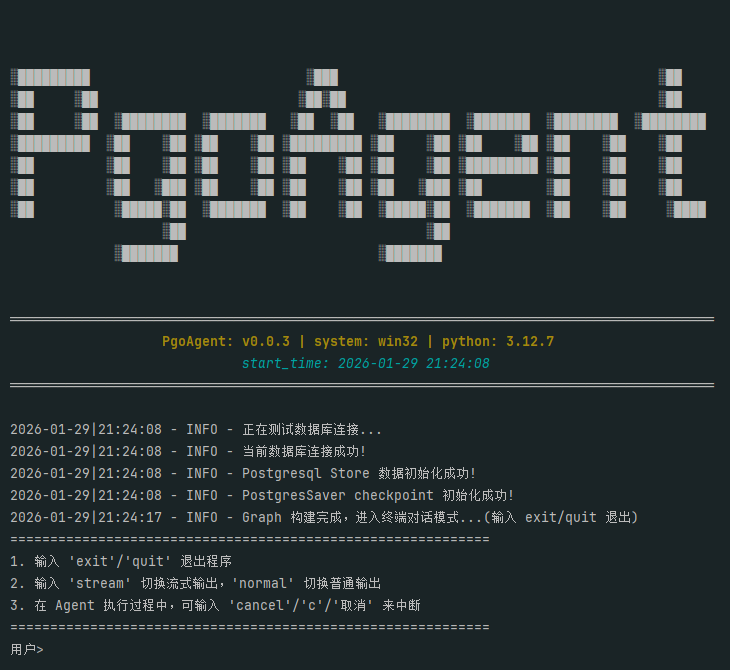


Web服务终端界面:


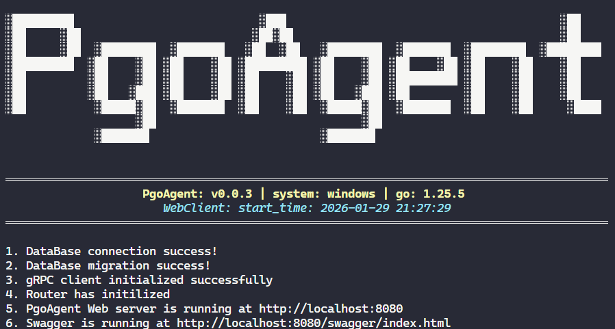


Swagger接口界面:
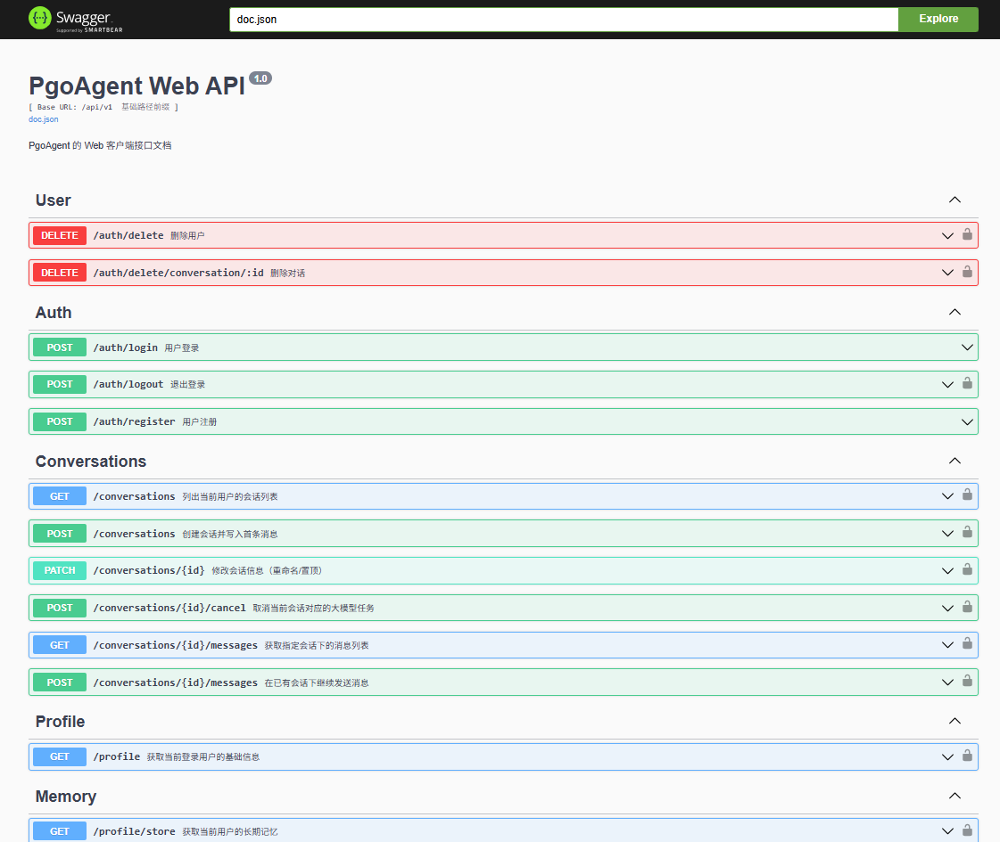

对话主界面:
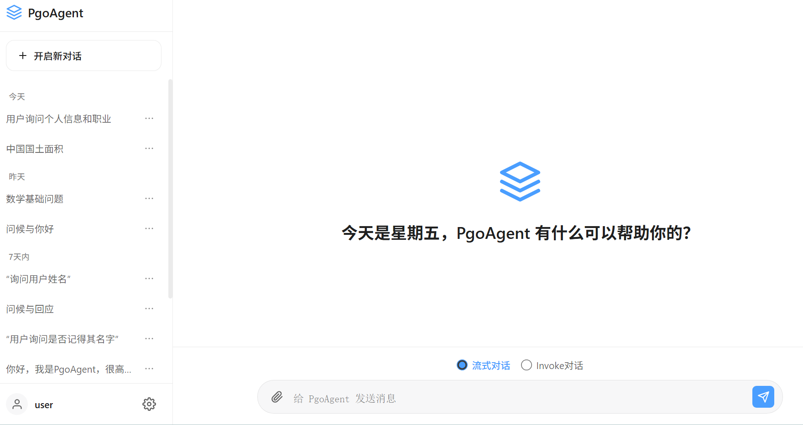

长期的记忆力刻画:
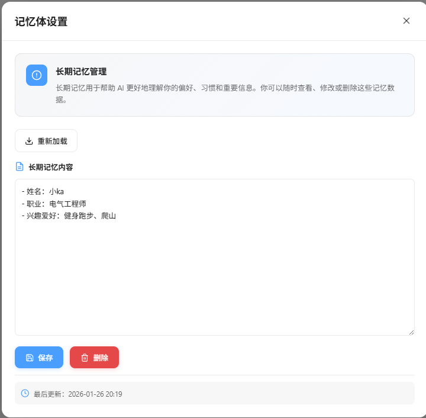

</div>


#### 对话场景1
<div align="center">

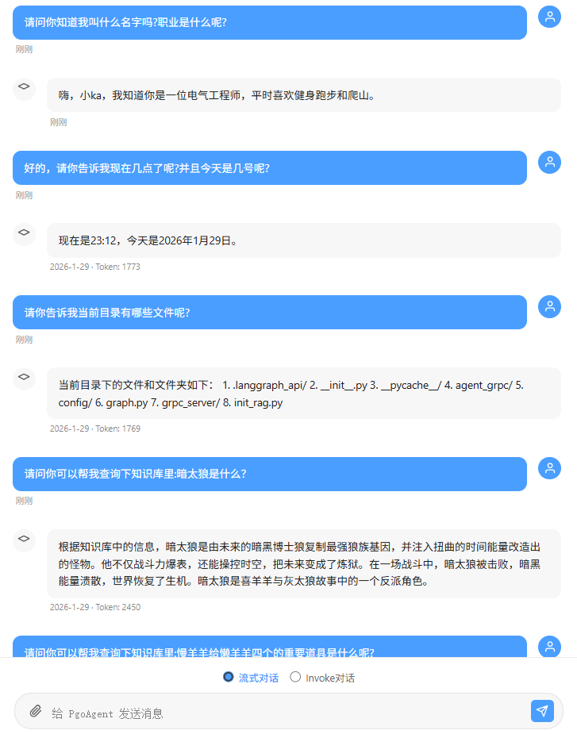

</div>

1. 第一句说明PgoAgent具有长期记忆力的存储，仍然记得用户的名字。
2. 第二句说明PgoAgent可以调用查询时间和日期的工具进行查询并回答给用户。
3. 第三句说明PgoAgent可以调用相关工具获得当前项目的文件目录的文件内容。
4. 第四句说明PgoAgent可以使用**Rag**查询当前知识库的内容。

#### 对话场景2
<div align="center">

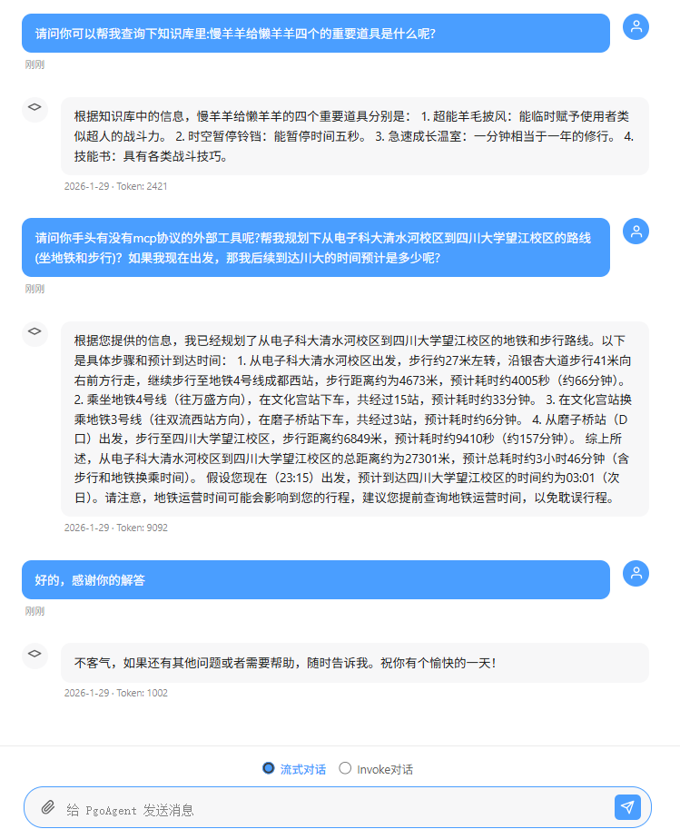

</div>

1. 第一句说明PgoAgent可以使用**Rag**查询当前知识库的内容。

2. 第二句说明PgoAgent可以成功调用**MCP**(这里使用高德MCP工具)，并给出路线规划，并且使用本地工具对达到时间进行了计算。

#### 微调结果 

#### 数据集生成结果:
<div align="center">

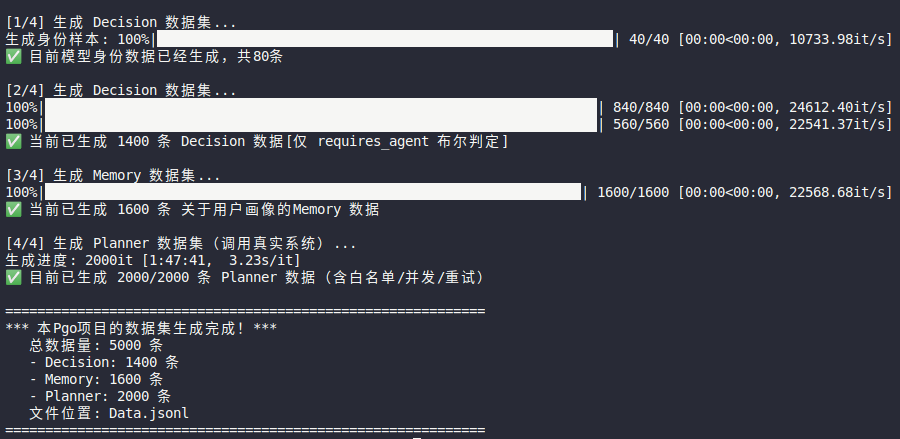

</div>

#### 微调的训练曲线图:
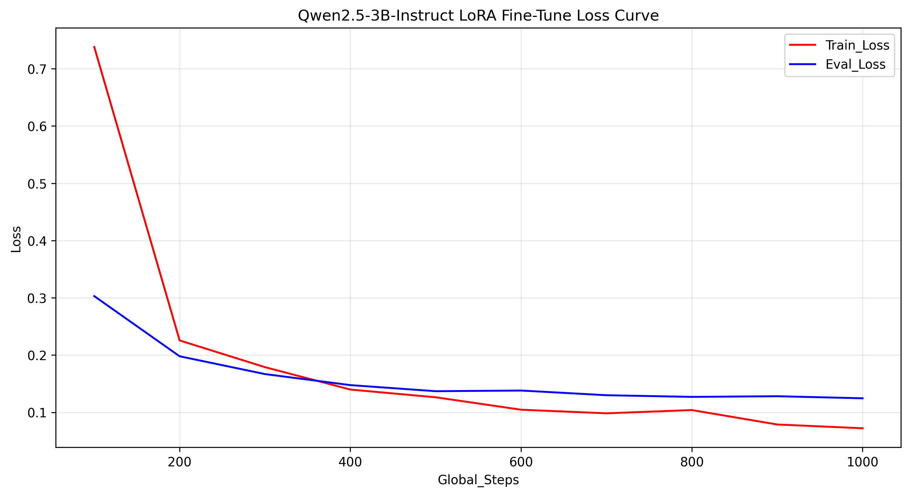


#### 微调后的身份确认:
<div align="center">

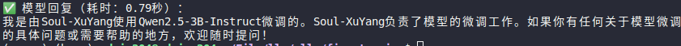

</div>


---


### 关于项目
```
📊 本项目PgoAgent详细代码统计报告
===========================================================================
文件类型             文件数         代码行数         文件大小       占比
---------------------------------------------------------------------------
Python                70            10468           410.82KB       44.8%
Go                    37             6100           204.74KB       26.1%
JavaScript             2             1715            61.63KB        7.3%
CSS                    2             1612            32.62KB        6.9%
Markdown               6             1363            65.47KB        5.8%
YAML                   1              694            16.29KB        3.0%
txt                    2              397            11.82KB        1.7%
HTML                   2              373            22.00KB        1.6%
Shell                  4              358            10.99KB        1.5%
TOML                   3              262             5.98KB        1.1%
===========================================================================
```
本项目耗费我近3个月的时间，从中对于Go和Python也学习到了很多，让我对于大语言模型（LLM）的原理与工程实践进行了系统性的思考。
希望本项目的实现与代码能对大家有所帮助，欢迎交流与学习。
最后，如果你觉得项目有价值，也欢迎点个 ⭐ 支持一下！


**版本**: v0.0.3  
**作者**: soul-xuyang  
**许可证**: MIT 

---
### 参考文献
1. [Langgrpah](https://langgraph.com.cn/index.html)
2. [Langchain](https://langchain-doc.cn/v1/python/langchain/overview.html)
3. [MCP.so](https://mcp.so/)
4. [魔搭社区](https://www.modelscope.cn/home)
5. [魔搭社区MCP](https://modelscope.cn/mcp)
6. [硅基流动](https://siliconflow.cn/)
7. [RAG 工作机制详解——一个高质量知识库背后的技术全流程](https://www.bilibili.com/video/BV1JLN2z4EZQ/?spm_id_from=333.337.search-card.all.click&vd_)
8. [Agent-with-RAG-and-Long-Term-Memory](https://github.com/scbarut/Agent-with-RAG-and-Long-Term-Memory)
9. [TF-IDF / BM25：经典的传统信息检索算法](https://blog.csdn.net/LFM3320829529/article/details/156383668?ops_request_misc=elastic_search_misc&request_id=55f13ebc7d8910b5f4b7f6d05d4b8c82&biz_id=0&utm_medium=distribute.pc_search_result.none-task-blog-2~all~sobaiduend~default-1-156383668-null-null.nonlogin&utm_term=TF-IDF%20bm25&spm=1018.2226.3001.4187)
10. [RAG提效利器——BM25检索算法原理和Python实现](https://zhuanlan.zhihu.com/p/670322092)
11. [DeepSeek+LoRA+FastAPI](https://www.bilibili.com/video/BV1R6P7eVEtd/?spm_id_from=333.337.search-card.all.click&vd_source=6db5e62cb01ffa248caaabea52932f34)
12. [如何训练一个大模型：LoRA篇](https://blog.csdn.net/xian0710830114/article/details/138710952?ops_request_misc=elastic_search_misc&request_id=7e53df9ba7b0d0e6339a9e1460ed0efd&biz_id=0&utm_medium=distribute.pc_search_result.none-task-blog-2~all~top_positive~default-1-138710952-null-null.nonlogin&utm_term=Lora&spm=1018.2226.3001.4187)
13. [LORA算法详解](https://blog.csdn.net/qq_41475067/article/details/138155486?ops_request_misc=elastic_search_misc&request_id=7e53df9ba7b0d0e6339a9e1460ed0efd&biz_id=0&utm_medium=distribute.pc_search_result.none-task-blog-2~all~top_click~default-2-138155486-null-null.nonlogin&utm_term=Lora&spm=1018.2226.3001.4187)
14. [MiniRag项目](https://github.com/yeldhopp/hk-MiniRAG)
> 如有遗漏或不当之处，欢迎联系我进行补充与完善。
> 希望同构建一个良好的科研、技术环境!

