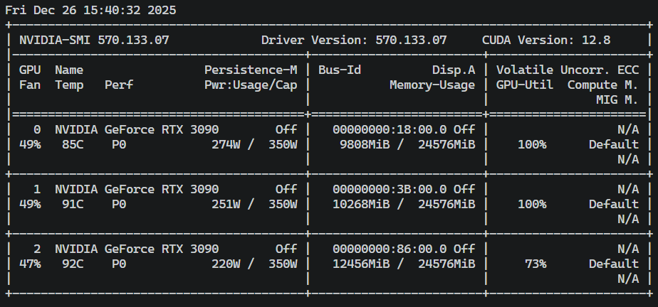

# PgoAgent 技术文档

部署和微调大模型须看！

Deployment and Fine-tuning of Large Language Models must be carefully considered.

---

## 项目概览

本项目主要包含两部分代码功能：

- **大模型部署**：基于 vLLM，将对话模型（chat）、文本嵌入模型（embedding）和重排序模型（rerank）统一部署为 OpenAI 兼容 API 服务。
- **小模型微调**：小模型微调注重于PgoAgent多个子图对话的微调，本项目以 Qwen2.5-3B-Instruct 为基座，构建多任务（身份确认、Decision、Memory、Planner）数据集并使用 LoRA 进行参数高效微调。

当前核心模型，如有需要可以替换：

- **Chat**：`Qwen3-8B`
- **Embedding**：`BAAI-bge-m3`
- **Rerank**：`BAAI/bge-reranker-base`

上述三个模型部署和测试都通过统一的配置文件 `deployment/config.toml` 管理，相关密钥和参数可在该配置文件中进行修改。


## 目录结构（简要）

实际目录请以 GitHub 仓库为准，核心结构如下：

```text
.
├── deployment/                   # 模型部署与测试相关脚本
│   ├── config.py                 # 统一的配置加载器 ConfigLoader
│   ├── config.toml               # 部署与测试配置文件（推荐只改这一处）
│   ├── run_chat_model.py         # 启动 Chat vLLM 服务
│   ├── run_embedding_model.py    # 启动 Embedding vLLM 服务
│   ├── run_rerank_model.py       # 启动 Rerank vLLM 服务
│   ├── test_chat_model.py        # 通过 AsyncOpenAI 测试 Chat 服务
│   ├── test_embedding_model.py   # 通过 AsyncOpenAI 测试 Embedding 服务（对标 test_chat）
│   └── test_rerank_model.py      # 使用 Transformers 测试 bge-reranker-base 模型
├── models/                       # 各类基础模型存放目录（Qwen / BGE / Reranker 等）
├── pictures/                     # 设备、损失曲线、架构图等可视化图片
├── tunning/                      # 微调程序代码
│   ├── train.py                  # 小模型（如 Qwen2.5-3B）LoRA 微调主脚本
│   ├── merged.py                 # 将 LoRA 权重合并为完整模型的脚本
│   ├── dataset_tasks_generator.py# 多任务数据集生成脚本(原始样本)
│   ├── convert_to_messages.py    # 将生成的原始原始样本转换为对话消息格式
│   ├── dataset_cleansing.py      # 对话消息格式的数据清洗
│   ├── dataset_spliter.py        # 数据集划分:训练 / 验证划分
│   ├── lora/                     # LoRA 训练输出的权重、日志、tokenizer 等
│   ├── temp/                     # 中间数据：原始数据集、清洗后数据集等
│   └── templates/                # （预留）数据模板相关代码
└── requirements.txt              # Python 依赖
```

---

## 环境准备

- 推荐环境：
  - 操作系统: linux(ubuntu 20.04)
  - Python 版本：`>=3.10`
  - CUDA：推荐 12.x，本次实验测试为12.8，示例环境为 3 × RTX 3090
  - 驱动版本示例：`570.133.07`

- 安装依赖：

```bash
pip install -r requirements.txt
```

显卡示意图（示例环境）：



---

## 使用 `deployment/config.toml` 统一管理配置

核心配置文件：`deployment/config.toml`，主要包含以下几块：

- **[global]**：全局默认配置  
  - `api_key`：统一 API Key  
  - `default_host`：默认监听地址  
  - `default_dtype`：默认数据类型（如 `bfloat16`）  
  - `default_gpu_memory_utilization`：默认显存利用率  
  - `default_max_num_seqs`：默认最大并发序列数  
  - `enable_log_requests` / `enable_log_stats`：是否启用请求 / 统计日志

- **[chat]**：Chat 模型部署配置  
  - `model_name` / `model_path` / `served_model_name`  
  - `cuda_visible_devices` / `tensor_parallel_size`  
  - `host` / `port`  
  - `gpu_memory_utilization` / `max_num_batched_tokens` / `max_model_len` / `dtype` / `max_num_seqs`

- **[embedding]**：Embedding 模型部署配置（BAAI-bge-m3）

- **[rerank]**：Rerank 模型部署配置（bge-reranker-base）

- **[test] + [test.chat] + [test.embedding] + [test.rerank]**：  
  - 统一的测试 `base_url` / `api_key`  
  - Chat 测试参数：`temperature`、`max_tokens`、`stream`  
  - Embedding 测试文本、最大长度、是否归一化等  
  - Rerank 的查询、文档列表、最大长度等

> **建议**：实际部署和测试只需要修改 `deployment/config.toml`，脚本会通过 `deployment/config.py` 中的 `ConfigLoader` 自动读取并组装命令。

---

## 大模型部署（vLLM）
这里的测试都是针对于本地服务器的网络 API 进行测试
### 启动 Chat 模型服务

```bash
cd deployment
python run_chat_model.py
```

脚本内部行为：

- 加载 `deployment/config.toml` 中的 `[chat]` 配置
- 设置 `CUDA_VISIBLE_DEVICES` 等环境变量
- 调用 `ConfigLoader.build_vllm_command("chat")` 构造 vLLM 启动命令：
  - `python -m vllm.entrypoints.openai.api_server ...`
- 打印最终命令并阻塞运行服务

### 启动 Embedding 模型服务

```bash
cd deployment
python run_embedding_model.py
```

- 读取 `[embedding]` 段配置（模型路径、端口、GPU 等）
- 启动 BAAI-bge-m3 的 Embedding 服务，OpenAI 兼容 `/v1/embeddings`。

### 启动 Rerank 模型服务

```bash
cd deployment
python run_rerank_model.py
```

- 读取 `[rerank]` 段配置
- 启动 bge-reranker-base 模型对应的 vLLM 服务（目前主要用于统一部署场景，测试脚本仍采用 Transformers 本地推理）。

---

##  本地 API 测试脚本

### Chat 测试：
运行 deployment/test_chat_model.py

- 使用 `AsyncOpenAI` 连接 `deployment/config.toml` 中 `[test]` 指定的 `base_url` 和 `api_key`。
- 从 `[chat]` 读取 `served_model_name`/`model_name` 决定 `model` 字段。
- 从 `[test.chat]` 读取：
  - `temperature`
  - `max_tokens`
  - `stream`（是否流式输出）

运行：

```bash
cd deployment
python test_chat_model.py
```

交互方式：

- 终端输入问题，模型流式或一次性返回回答
- 输入 `exit` / `quit` 退出

###  Embedding 
运行 deployment/test_embedding_model.py

- 对标 `test_chat_model.py` 的结构与风格：
  - 使用 `ConfigLoader` 读取 `[embedding]`、`[test]`、`[test.embedding]`
  - 使用 `AsyncOpenAI` 调用 `/v1/embeddings`
- 支持两种输入方式：
  - 直接按回车：使用配置中的 `test_texts`
  - 自己输入一句文本：只对该条文本生成向量

运行：

```bash
cd deployment
python test_embedding_model.py
```

脚本会展示：

- 使用当前使用的模型和服务地址
- 每条文本的 embedding 维度与前若干维示例值

### Rerank 测试：
运行deployment/test_rerank_model.py

- 使用 `deployment/config.py` 中的 `ConfigLoader` 读取：
  - `[rerank]`：`model_path`
  - `[test.rerank]`：`query`、`documents`、`max_length`
- 采用 `transformers` 的 `AutoModelForSequenceClassification` 与 `AutoTokenizer`：
  - 计算 `(query, document)` 对的相关性分数
  - 按分数从高到低排序并打印前若干条

运行：

```bash
cd deployment
python test_rerank_model.py
```

> 补充:如需将 Rerank 也改成 OpenAI 风格接口测试（统一通过 HTTP 调用），可以在已有 vLLM 服务基础上扩展一层 API 或在前端路由里增加 rerank 任务，再调整本脚本调用方式。

---

## 微调小模型（LoRA）

这一部分主要针对 **PgoAgent 内部的多任务决策小模型**，例如以 Qwen2.5-3B-Instruct 为基座模型，对以下任务进行联合训练：

- **身份确认 / 测试问题**:用于检查当前模型微调效果是否生效
- **Decision（是否调用工具 / require_agent）**
- **Memory（用户画像与长期记忆）**
- **Planner（调用工具前的规划）**

### 微调相关文件结构

```text
tunning/
├── dataset_tasks_generator.py   # 2/3 任务数据集生成
├── convert_to_messages.py       # 将原始 JSONL 转为 messages 格式
├── dataset_cleansing.py         # 清洗异常样本
├── dataset_spliter.py           # 训练/验证集划分
├── temp/
│   ├── origin_dataset.jsonl     # 原始生成的数据集
│   ├── dataset_message.jsonl    # 转换后的消息格式
│   ├── dataset_cleansing.jsonl  # 清洗后的数据集
│   ├── train_dataset.jsonl      # 训练集
│   ├── validate_dataset.jsonl   # 验证集
│   └── loss_curve.png           # 训练过程 loss 曲线
├── train.py                     # LoRA 微调主脚本
├── merged.py                    # 将 LoRA 权重合并为完整模型
└── lora/                        # LoRA 输出目录（权重、日志等）
```

其中，`pictures/3tasks_dataset_generator.png` 展示了 3-tasks 数据集生成器的大致架构：


###  数据集与流程概览

整体流程：

1. 使用 `dataset_tasks_generator.py` 生成 **3 任务** 数据集（示例：5000 / 3000 条样本，其中一部分为身份验证样本）。  
   - **建议**：生成 Planner 类样本时，尽量使用本地部署的 **大模型**（参数量大、能力强），数据质量会显著更好。
2. 通过 `convert_to_messages.py` 将原始 JSONL 转为适合 Chat 模式的 `messages` 结构。
3. 使用 `dataset_cleansing.py` 清洗无效样本、异常对话等。
4. 使用 `dataset_spliter.py` 将数据拆分为 `train_dataset.jsonl` 和 `validate_dataset.jsonl`。
5. 使用 `train.py` 进行 LoRA 微调，并在 `pictures/loss_curve.png` 或 `tunning/temp/loss_curve.png` 中查看训练曲线。

此外，我们在训练过程中使用了早停策略，示例中在 step≈800 时停止以防止过拟合：


###  训练环境与注意事项

- 示例训练环境：
  - 3 × RTX 3090，使用多卡 DDP 进行训练
  - 基座模型：**Qwen2.5-3B-Instruct**
  - 数据类型：根据显卡支持选择 `bfloat16` 或 `float16`


训练前需确认：

1. 基座模型支持的数据类型（如 Qwen 系列原生支持 `bf16`）。
2. 显卡是否支持 `bf16` 或只适合使用 `float16`。例如 3090 原生支持 `float16` 的 Tensor Core 加速。
3. 根据显存与卡数合理设置：
   - `per_device_train_batch_size`
   - `gradient_accumulation_steps`
   - 全局 batch size（建议留出冗余空间以适配不同显卡）。

###  训练参数示例（节选）

下面是一个典型的**TrainingArguments**设置片段（可在 `train.py` 中参考和调整）：

```python
args = TrainingArguments(
    output_dir=OUTPUT_DIR,
    per_device_train_batch_size=4,
    per_device_eval_batch_size=4,
    gradient_accumulation_steps=2,
    num_train_epochs=5,
    learning_rate=1e-4,
    warmup_ratio=0.05,
    lr_scheduler_type="cosine",
    fp16=True,  # 若显卡支持 bf16，可切换为 bf16=True
    logging_steps=100,
    save_steps=100,
    eval_strategy="steps",
    eval_steps=100,
    save_total_limit=2,
    group_by_length=True,
    remove_unused_columns=False,
    logging_dir=f"{OUTPUT_DIR}/logs",
    ddp_find_unused_parameters=False,
    report_to="none",
    run_name="finetune",
    load_best_model_at_end=True,
)
```

多卡 DDP 训练示例（Linux 环境）：

```bash
CUDA_VISIBLE_DEVICES=1,2 torchrun --nproc_per_node=2 tunning/train.py
```

带错误日志的调试命令示例：

```bash
CUDA_VISIBLE_DEVICES=1,2 TORCHELASTIC_ERROR_FILE="./torch_error.log" PYTHONFAULTHANDLER=1 \
torchrun --nproc_per_node=2 tunning/train.py
```

补充说明：

- 这里使用 DDP 的原因是：对小模型做 LoRA 微调时，多卡可以显著缩短训练时间，且显存充足。
- 若使用单卡，也可以在加载模型时设置 `device_map="auto"`，自动进行硬件检测和负载均衡：

```python
model = AutoModelForCausalLM.from_pretrained(
    MODEL_PATH,
    trust_remote_code=True,
    dtype=torch.float16,
    device_map="auto",
)
```

---

##  合并 LoRA 权重与部署微调模型

###  合并权重

这里使用LoRA进行测试微调，首先原始参数矩阵为$$W_{\text{orig}} \in \mathbb{R}^{N \times D}$$

两个低秩矩阵分别为列矩阵$B$(全零初始化)和行矩阵$A$(随机数初始化),r为矩阵的秩，本次实验默认使用8:

$$B \in \mathbb{R}^{N \times r}, \quad A \in \mathbb{R}^{r \times D}$$
低秩约束：$$r \ll \min(N,D)$$

实际上计算的LoRA 权重更新量:
$$\Delta W = B \cdot A$$

后续实际上带缩放因子(其中$\alpha 是一个可手动条抓的超参数，这里默认值为1$)的最终模型 LoRA 权重如下:
$$W_{\text{LoRA}} = W_{\text{orig}} + \frac{\alpha}{r} \cdot B A$$

最后运行的脚本代码即可进行合并`./models/qwen2.5-3b-lora-merged`

### 使用 vLLM 部署微调后模型

可以参考如下命令（根据实际需要调整路径模型参数、GPU数量、数据类型以及端口号等）：

```bash
export CUDA_VISIBLE_DEVICES=2

python -m vllm.entrypoints.openai.api_server \
  --model ./models/qwen2.5-3b-lora-merged \
  --trust-remote-code \
  --dtype float16 \
  --port 8001 \
  --host 0.0.0.0 \
  --tensor-parallel-size 1 \
  --gpu-memory-utilization 0.90 \
  --served-model-name qwen-lora  
```
或者可以运行fine_tuning文件夹下的deploy.py进行部署,后续测试是否部署和微调成功可使用对应的test.py进行测试。
使用以下代码进行部署：
```
python deploy.py \
  --device 0 \
  --name qwen2.5-3b-lora-merged \
  --path ../models/qwen2.5-3b-lora-merged \
  --host 0.0.0.0 \
  --port 8000
```
测试代码:
```
python test.py
```
最终微调效果示例（回答质量示意）：


---

### 总结
**版本**: v0.0.3  
**作者**: soul-xuyang  
**许可证**: MIT 
本次代码主要是为了学习和实验测试，系统性学习大模型的部署和微调流程。

如有问题可在我的gitHub提交相关代码或者联系邮箱610415432@qq.com进行交流